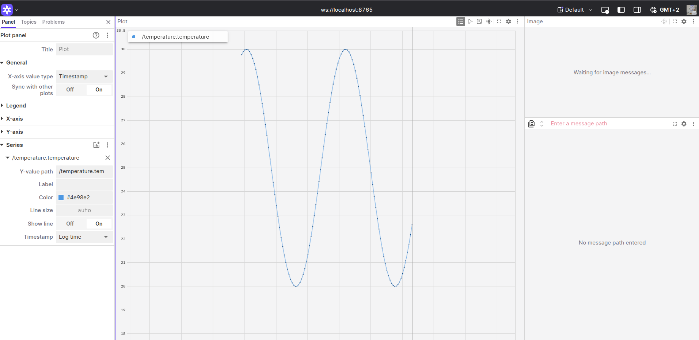

# Temperature Monitoring

## How to setup

1. `git clone https://github.com/YaraShahin/robotics-software-community.git`: 
    clone the monorepo. The repo already contains both workspaces for the publisher and subscriber containers.
2. `cd 1-temperature-monitor`
3. `just setup-project`:
    a. symlinks the relevant packages from packages dir to each workspace src
    b. runs docker compose build to build both containers
    c. runs each container and installs all dependencies and builds the workspace.

## How to run

1. In `1-temperature-monitor`:
    a. `just run-project`: This will run both containers with their entrypoints set to run the corresponding launch files for nodes and foxglove bridge.
    ** In case you want to enter the publisher container: `just run-publisher`
    ** In case you want to enter the subscriber container: `just run-subscriber`

2. Web Visualization
    a. Open foxglove web UI: https://app.foxglove.dev/
    b. Select `Open a connection`>`Foxglove WebSocket` > `ws://localhost:8765`
    c. Select a "Plot" panel and selext the temperature topic as the y-value.
    c. You should see a temperature graph like this:
        

## Package Structure

```bash
    .
    ├── packages
    │   ├── temperature_monitoring_bringup      # launch and configuration files to start the system (launch files, params)
    │   ├── temperature_monitoring_interfaces   # custom ROS 2 message/service definitions used by nodes
    │   ├── temperature_publisher               # node that generates/simulates and publishes temperature readings
    │   └── temperature_subscriber              # node that receives, processes, logs, and alerts on temperature data
    ├── workspaces
    │   ├── temperature_publisher_ws            # colcon workspace for building the publisher container packages
    │   └── temperature_subscriber_ws           # colcon workspace for building the subscriber container packages
    ├── entrypoint.sh                           # container entrypoint that prepares the environment and launches the system
    ├── Justfile                                # task runner recipes (setup, build, run commands used via just)
    ├── docs                                    # documentation images and assets
    ├── README.md                               # project overview and usage instructions
    ├── task.md                                 # assignment or development tasks
    ├── docker-compose.yaml                     # docker-compose definition to run publisher, subscriber, and supporting services
    └── Dockerfile                              # base image and build steps for the containers
```

## Features

### Inter-container communication

- Containers run on a single Docker user-defined bridge network; containers can address each other by service name or IP assigned by docker-compose.
- ROS 2 traffic crosses containers via the Foxglove bridge (WebSocket on localhost:8765) and direct ROS 2 UDP multicast when using the default FastDDS RMW.

### Sinusoidal Noise

- Samples are generated as:
    temperature = offset + amplitude * sin(phase)
- amplitude and offset ensure the generated temperature stays within the configured temperature_range.
- Adjust the phase increment or publish rate to achieve the desired cycles/time.

### Subscriber Temperature Analytics

- Sliding window: the subscriber keeps the last 10 temperature samples (pop front when size == 10, then push_back the new value).
- Min / Max: on the first sample both min and max are initialized to that value; thereafter min_temp_ and max_temp_ are updated with std::min/std::max against the new sample.
- Moving average: computed as std::accumulate(recent_temps_.begin(), recent_temps_.end(), 0.0) / recent_temps_.size().
- Trend detection:
    - Uses the two most recent samples.
    - If |delta| < 0.01 → "stable".
    - If delta > 0 → "rising".
    - If delta < 0 → "falling".
- Warning system:
    - Normal range: NORMAL_MIN = 23.0, NORMAL_MAX = 27.0.
    - If the current temperature is < NORMAL_MIN or > NORMAL_MAX a warning is emitted via RCLCPP_WARN indicating the sensor id and value.

### Web Visualisation

- Use Foxglove Studio (https://app.foxglove.dev/) to view temperature topic analytics via WebSocket bridge:
    - Open connection → Foxglove WebSocket → ws://localhost:8765
    - Add panels: Plot for time series, Status panel for warning levels, and Table for raw messages.

### QoS Profile

- The project uses a mixed QoS profile tuned for telemetry and service use:
    - KeepLast history with depth 1: only the latest sample is kept.
    - Best-effort reliability: low-latency, lossy telemetry (acceptable for frequent sensor updates).
    - Transient local durability: late-joining subscribers receive the last published value.
- Example C/C++ static profile:
    ```
    static const rmw_qos_profile_t qos_services = {
            RMW_QOS_POLICY_HISTORY_KEEP_LAST,
            1,  // message queue depth
            RMW_QOS_POLICY_RELIABILITY_BEST_EFFORT,
            RMW_QOS_POLICY_DURABILITY_TRANSIENT_LOCAL,
            RMW_QOS_DEADLINE_DEFAULT,
            RMW_QOS_LIFESPAN_DEFAULT,
            RMW_QOS_POLICY_LIVELINESS_SYSTEM_DEFAULT,
            RMW_QOS_LIVELINESS_LEASE_DURATION_DEFAULT,
            false};
    ```
- When switching RMW (e.g., to Cyclone DDS), verify QoS mapping and DDS participant configuration (multicast, discovery) for consistent behavior.

### Notes

- Default rmw implementation fastdds is used.
- To test inter-container communication:
    ```bash
    Publisher container
    root@1292b466a8ff:/# ros2 multicast send
    Sending one UDP multicast datagram...

    Subscriber container
    root@4422c32bed4f:/# ros2 multicast receive
    Waiting for UDP multicast datagram...
    Received from 172.19.0.3:59478: 'Hello World!'
    ```

- Default time syncronization between containers (since they use same clock source on device) has satisfactory performance as seen in timestamps:
    ```bash
    temperature_subscriber  | [INFO] [1766352970.924583734] [temperature_subscriber_node]: Received temperature: 23.45  from sensor 'sensor_1' | Moving Avg: 21.68 | Min: 20.00 | Max: 30.00 | Trend: rising
    temperature_publisher   | [INFO] [1766352970.925232009] [temperature_publisher_node]: Publishing: "23.44651357452895", Sensor ID: "sensor_1"
    ```
    Note: the subscriber logs first since the publisher node prints after the message is already published.

## Resources used

- Folder structure: https://github.com/WATonomous/wato_monorepo/blob/main/docs/monorepo.md